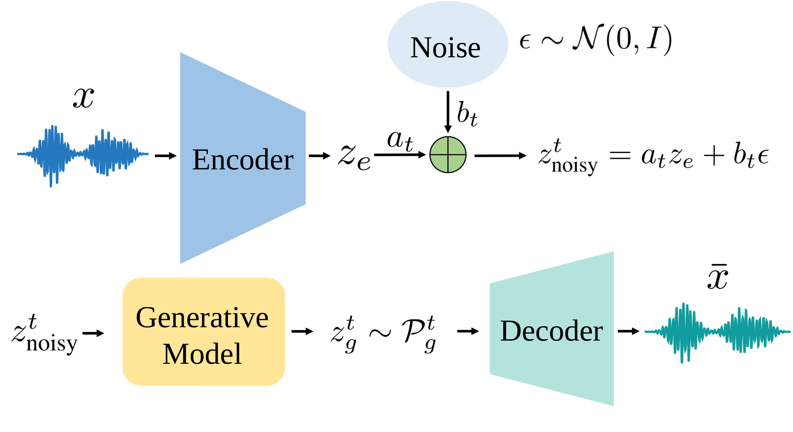

<div align="center">

# AudioGAR: Bridging Reconstruction and Generation

### in Latent Audio Generative Models

[](docs/assets/AudioGAR.pdf)
[](https://sunset-clouds.github.io/Audio-GAR/)
[](docs/assets/AudioGAR.pdf)
[](https://huggingface.co/overfittingexpert/Audio-GAR)

**[Xianghong Fang](https://sunset-clouds.github.io/)<sup>1,⋆</sup> &middot; Geeyang Tay<sup>1,⋆</sup> &middot; Wentao Ma<sup>1</sup> &middot; Tim G. J. Rudner<sup>1,2</sup> &middot; Dehan Kong<sup>1</sup>**

<sup>1</sup>University of Toronto &nbsp;&nbsp; <sup>2</sup>Vijil &nbsp;&nbsp; <sup>⋆</sup>Equal contribution

</div>

> **TL;DR:** AudioGAR bridges the decoder's reconstruction-generation mismatch by fine-tuning on generation-aware latents that retain correspondence with source audio. On AudioX, it reduces FAD by 31.3% on MusicCaps and 16.8% on AudioCaps, using 1.5% of the original training audio and 0.26% of the original training cost, with no additional inference cost.

<p align="center">
  <a href="docs/assets/AudioGAR_pipeline.pdf">
    
  </a>
  <br>
  <big><big>Generation-aware codec decoder adaptation with AudioGAR.</big></big>
</p>

## Overview

Latent audio models train the codec decoder on encoder-induced latents but use generator-produced latents at inference. AudioGAR constructs intermediate latents by perturbing encoder latents and denoising them through the frozen generative model. Lower-noise latents retain correspondence with the source waveform, enabling paired supervision for decoder adaptation.

We keep the codec encoder and latent generative model frozen. For AudioX, we fine-tune only the codec decoder; for TangoMusic, we jointly fine-tune the VAE decoder and HiFi-GAN vocoder. This repository provides latent caching, decoder adaptation, and generation evaluation code.

## Main Results

Comparison with AudioX-MAF and TangoMusic on MusicCaps and AudioCaps. Arrows indicate the preferred direction.

| Model | Dataset | gFAD ↓ | gFD ↓ | KL ↓ | IS ↑ | PC ↑ | PQ ↑ |
|---|---|---|---|---|---|---|---|
| AudioX | MusicCaps | 1.60 | 9.56 | 1.00 | 3.65 | 4.78 | 6.61 |
| **AudioGAR AudioX** | MusicCaps | 1.10 | 8.33 | 0.99 | 3.59 | 4.75 | 6.56 |
| AudioX | AudioCaps | 1.61 | 11.83 | 1.31 | 12.47 | 3.16 | 5.73 |
| **AudioGAR AudioX** | AudioCaps | 1.34 | 11.62 | 1.29 | 12.06 | 3.11 | 5.73 |
| TangoMusic | MusicCaps | 1.85 | 15.20 | 1.09 | 2.85 | 5.62 | 7.22 |
| **AudioGAR TangoMusic** | MusicCaps | 1.47 | 14.25 | 1.09 | 2.83 | 5.61 | 7.16 |

## Models and Evaluation Cache

- Decoder weights: [overfittingexpert/Audio-GAR](https://huggingface.co/overfittingexpert/Audio-GAR)
  ([audiox-maf](https://huggingface.co/overfittingexpert/Audio-GAR/tree/main/audiox-maf),
  [tango-music](https://huggingface.co/overfittingexpert/Audio-GAR/tree/main/tango-music))
- Eval dataset (cached latent): [eval_cache](https://huggingface.co/overfittingexpert/Audio-GAR/tree/main/eval_cache)

## Repository Structure

```text
Audio-GAR/
|-- exp_latent_cache.py    # Construct and cache AudioGAR latents
|-- exp_train_decoder.py  # Fine-tune decoder components
|-- eval.py               # Evaluate reconstruction and generation
|-- src/                  # Datasets, models, training, and evaluation utilities
|-- docs/                 # Project page, paper, and figures
|-- pyproject.toml        # Project dependencies
`-- uv.lock               # Dependency lockfile
```

## Setup

The code runs as a package named `audio_gar`, so clone it under that name.

```bash
git clone https://github.com/ml-maple-monk/Audio-GAR.git audio_gar
uv sync --project audio_gar
```

## Evaluation Data

Metric weights and the pretrained AudioX-MAF come from their public releases:

```bash
mkdir -p data/fad_checkpoints
curl -L -o data/fad_checkpoints/fad_panns_cnn14_pytorch.pth \
  "https://zenodo.org/record/3987831/files/Cnn14_mAP%3D0.431.pth"
curl -L -o data/fad_checkpoints/fad_vggish_pytorch.pth \
  https://github.com/harritaylor/torchvggish/releases/download/v0.1/vggish-10086976.pth
curl -L -o data/fad_checkpoints/audiobox_aesthetics_checkpoint.pt \
  https://dl.fbaipublicfiles.com/audiobox-aesthetics/checkpoint.pt
uv run --no-sync --project audio_gar hf download HKUSTAudio/AudioX-MAF model.ckpt --local-dir data/audiox-maf
```

Reference audio is not redistributed. Place the AudioCaps and MusicCaps test clips under
`data/eval_datasets/<dataset>/` with a `manifest.csv` holding one row per caption:

## Getting Started

```bash
# Fine-tuned decoder and eval cache from the Hub.
uv run --no-sync --project audio_gar hf download overfittingexpert/Audio-GAR \
  --include "audiox-maf/n0.2/decoder_100k.pt" "eval_cache/audiox-maf/musiccaps/*" \
  --local-dir hub

# 1. Latent cache: one-step denoised generator latents at noise level 0.2.
uv run --no-sync --project audio_gar python -m audio_gar.exp_latent_cache \
  --generator audiox-maf --noise_levels 0.2 \
  --data_root data --out_dir caches/audiox-maf

# 2. Decoder fine-tuning on the cached latents.
uv run --no-sync --project audio_gar python -m audio_gar.exp_train_decoder finetune \
  --cache_dirs caches/audiox-maf --level 0.2 --max_train_steps 100000 \
  --data_root data --out_dir runs/audiox-maf-n0.2

# 3. TangoMusic: cache at noise level 0.1, then joint decoder and vocoder training.
uv run --no-sync --project audio_gar python -m audio_gar.exp_latent_cache \
  --generator tango-music-af-ft-mc --noise_levels 0.1 \
  --data_root data --out_dir caches/tango-music
uv run --no-sync --project audio_gar python -m audio_gar.exp_train_decoder joint \
  --cache_dirs caches/tango-music --level 0.1 --max_train_steps 30000 \
  --data_root data --out_dir runs/tango-music-n0.1

# 4. Generation eval with the released decoder and eval cache.
uv run --no-sync --project audio_gar python -m audio_gar.eval \
  --model audiox-maf --dataset musiccaps --evaluation gen_ref \
  --base_ckpt data/audiox-maf/model.ckpt \
  --decoder_ckpt hub/audiox-maf/n0.2/decoder_100k.pt \
  --generation_cache hub/eval_cache/audiox-maf/musiccaps --cache_artifact_dir art \
  --data_root data --out_dir results/audiox-maf-musiccaps
```

## Citation

If this work is useful for your research, please cite:

```bibtex
@article{fang2026audiogar,
  title   = {AudioGAR: Bridging Reconstruction and Generation in Latent Audio Generative Models},
  author  = {Fang, Xianghong and Tay, Geeyang and Ma, Wentao and Rudner, Tim G. J. and Kong, Dehan},
  journal = {Arxiv},
  year    = {2026}
}
```
